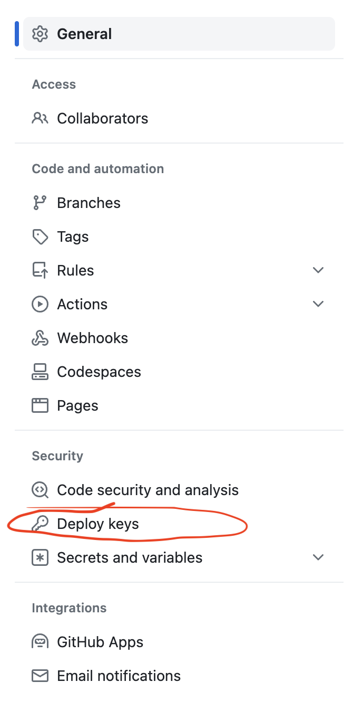
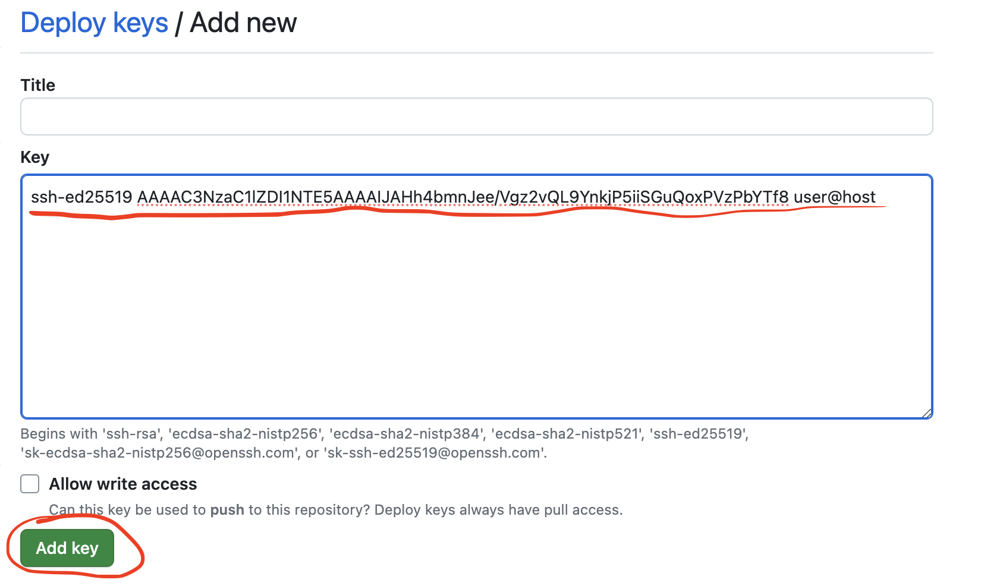
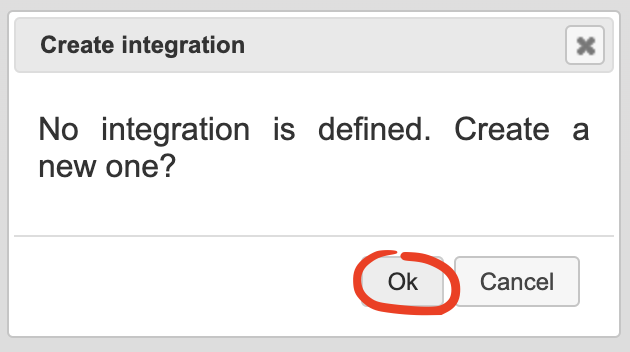
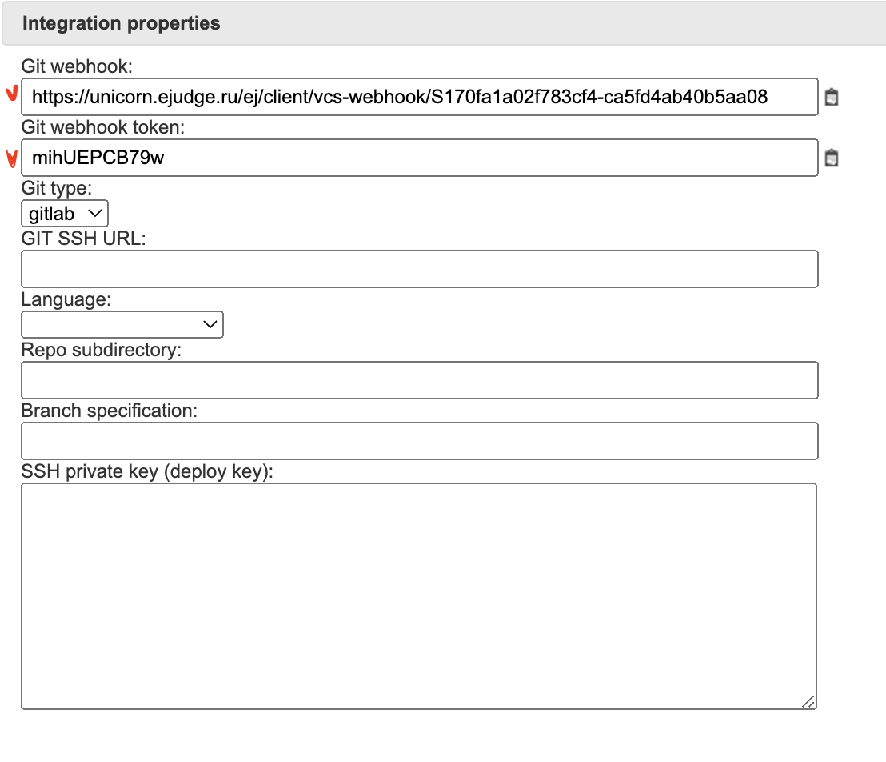
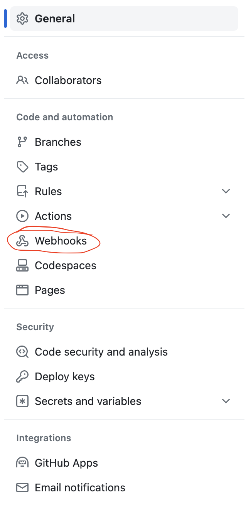
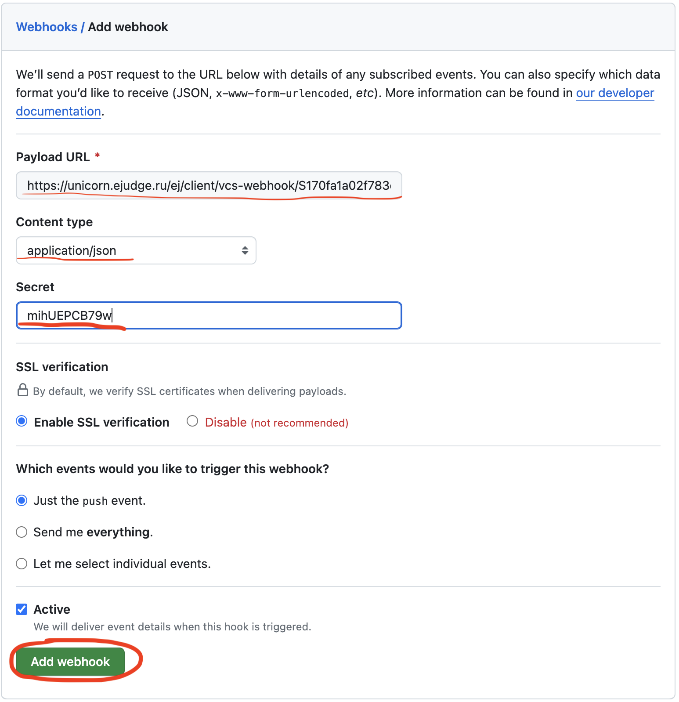
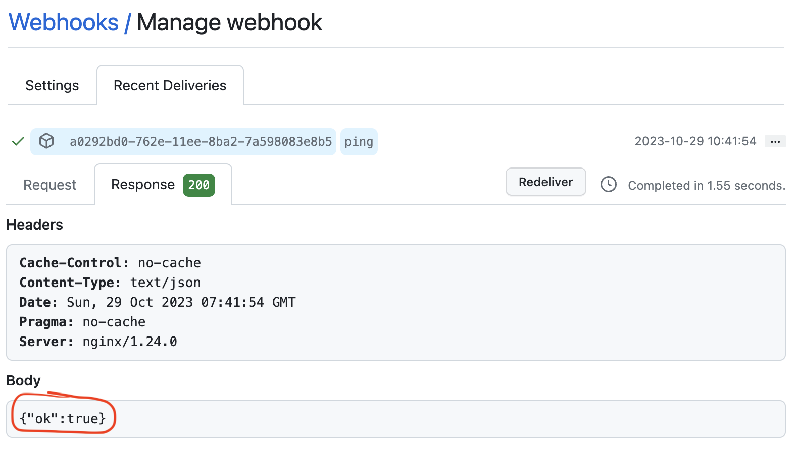
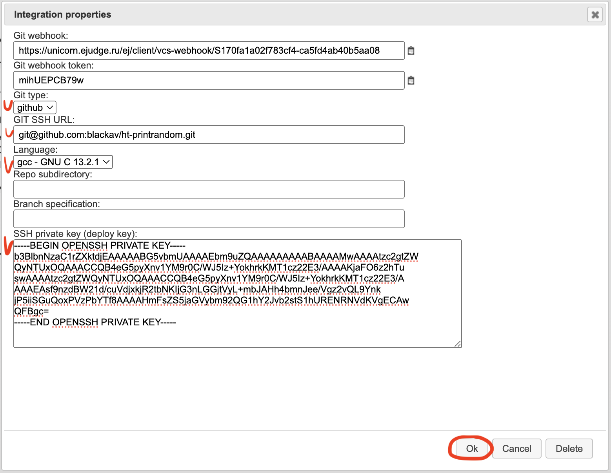

# Интеграция ejudge и github

В данном документе описывается, как подключить репозиторий на github к задаче в ejudge.
При успешном подключении любой push в репозиторий приводит к автоматическому
скачиванию новой версии программы в ejudge и её проверке на тестах. Результат
проверки будет доступен в интерфейсе ejudge.

Предполагается, что аккаунт на github уже создан, ключи для работы через git ssh настроены.

## Как это работает

1. Пользователь выполняет push в репозиторий.
2. github выполняет HTTP POST запрос по некоторому адресу, уведомляя стороннюю систему, в нашем случае ejudge, о том, что состояние репозитория изменилось. Этот механизм называется webhooks.
3. ejudge обрабатывает запрос, клонируя репозиторий на github в систему. Для доступа к репозиторию на чтение используется ssh-ключ, так называемый deploy key, причем у ejudge должна быть его приватная часть, а у github - публичная часть.
4. Из склонированного репозитория формируется архив, который отправляется на проверку от имени пользователя, настроившего интеграцию, и далее задача обрабатывается стандартным для ejudge способом.

Если вам всё или многое понятно, то вы можете сразу приступить к настройке интеграции.

## Создание deploy key

Для того чтобы ejudge мог клонировать репозиторий из github необходим ssh-ключ, причем
у ejudge должна быть его приватная часть, а в github нужно поместить публичную часть.
Не нужно отдавать в ejudge приватную часть какого-либо существующего ключа, а лучше всего сгенерировать новый ключ специально для ejudge.

Если у вас уже есть сгенерированный ранее deploy key для ejudge, нет необходимости 
генерировать новый ключ для каждой задачи, можно использовать уже существующий. 

```
ssh-keygen -t ed25519 -f ejudge-deploy
```

Поле "passphrase" оставьте пустым (два раза нажмите "Enter"). В результате должны
быть созданы два файла: `ejudge-deploy` - это приватная часть ключа, и `ejudge-deploy.pub` - это публичная часть ключа.

## Добавление deploy key в проекте github

На странице проекта выберите вкладку "Settings".


Затем на странице настроек слева выберите "Deploy keys".



На странице "Deploy keys" нажмите на "Add deploy key".


Далее в поле ввода "Key" скопируйте содержимое файла `ejudge-deploy.pub` и нажмите "Add key".



Возможно, после нажатия кнопки, github запросит подтверждение операции с помощью ввода OTP-фактора.

Один и тот же deploy key можно использовать для разных интеграций, например, для сдачи разных задач.

## Добавление webhook в проект в github

Теперь в ejudge перейдите на страницу с условием задачи и нажмите кнопку "Setup Version Control System Integration" под условием задачи.

На вопрос о создании новой интеграции отвечайте "Ok".



Сейчас нас интересуют поля "Git webhook" и "Git webhook token".



Далее вернитесь на страницу github на страницу "Settings", и в меню слева выберите "Webhooks".



Нажмите "Add webhook"


В поле "Payload URL" скопируйте текст из поля "Git webhook" формы в ejudge.

В поле "Content type" выберите "application/json".

В поле "Secret" скопируйте текст из поля "Git webhook token".

Остальное оставьте без изменений и нажмите кнопку "Add webhook".



Чтобы убедиться, что webhook успешно добавился, из списка webhook
откройте его по ссылке, затем откройте вкладку "Recent deliveries"
и на ней перейдите по ссылке на "ping"-запросе. На вкладке "Response"
вы должны увидеть в Body `{"ok":true}`.



## Настройка интеграции в ejudge

Теперь вернитесь на страницу с условием задачи в ejudge, на которой должна
быть открыта форма "Integration properties".

В поле "Git type" выберите "github".

В поле "Git SSH URL" скопируйте URL, по которому репозиторий клонируется из github.

В поле "Language выберите нужный язык программирования".

Поля "Repo subdirectory" и "Branch specification" оставьте пустыми.

В поле "SSH private key (deploy key)" скопируйте содержимое файла `ejudge-deploy`.

Нажмите "Ok".



## Успех!

Если вы все сделали правильно, операция push в репозиторий git
приведет к тому, что последняя версия кода будет скачана, скомпилирована
и протестирована.

При просмотре исходного кода в ejudge вы не увидите непосредственно код,
но специальным образом подготовленный текстовый файл, который содержит
заархивированный каталог с кодом.
